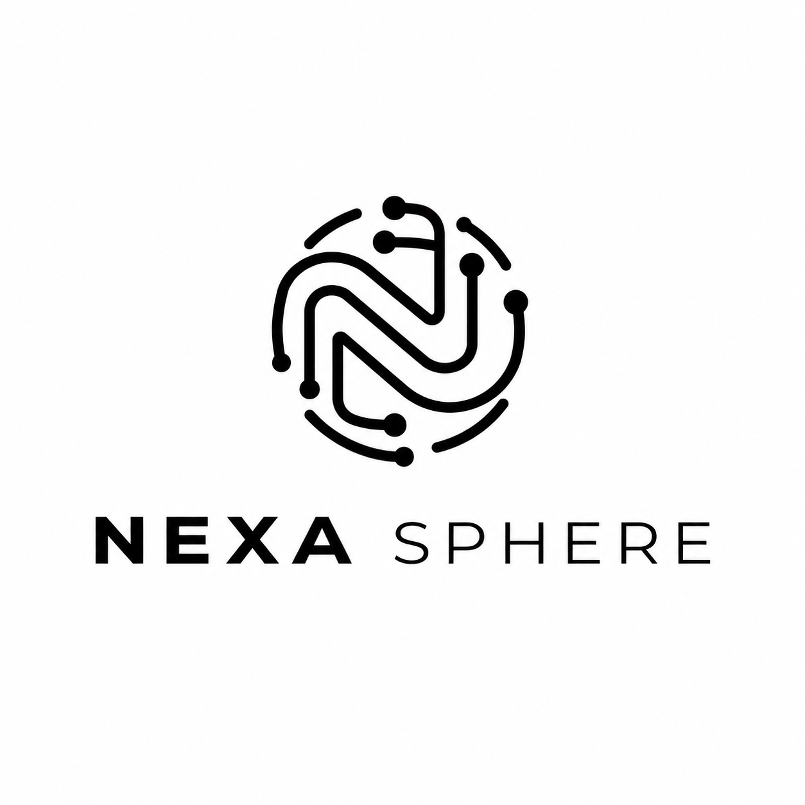

<html lang="en">
<head>
<meta charset="utf-8">
<meta name="viewport" content="width=device-width, initial-scale=1, viewport-fit=cover">
<title>Brew &amp; Bloom · Menu</title>
<link rel="preconnect" href="https://fonts.googleapis.com">
<link rel="preconnect" href="https://fonts.gstatic.com" crossorigin>
<link href="https://fonts.googleapis.com/css2?family=DM+Sans:wght@400;500;600&family=Fraunces:opsz,wght@9..144,500;9..144,600&display=swap" rel="stylesheet">

</head>
<body>

  <header class="hero">
    

      <h1>Brew &amp; Bloom</h1>
      
Coffee, small plates and slow afternoons.

      

        Open 8 am to 11 pm
        
        Sample menu
      

    

    <svg class="bloom" viewBox="0 0 120 120" aria-hidden="true">
      <g transform="translate(60 60)">
        <g fill="#E58FA3">
          <ellipse cx="0" cy="-32" rx="15" ry="26" />
          <ellipse cx="0" cy="-32" rx="15" ry="26" transform="rotate(72)" />
          <ellipse cx="0" cy="-32" rx="15" ry="26" transform="rotate(144)" />
          <ellipse cx="0" cy="-32" rx="15" ry="26" transform="rotate(216)" />
          <ellipse cx="0" cy="-32" rx="15" ry="26" transform="rotate(288)" />
        </g>
        <ellipse cx="0" cy="0" rx="17" ry="22" fill="#2B1A12" transform="rotate(-24)" />
        <path d="M-5 -19 C 6 -8, -6 6, 5 19" fill="none" stroke="#F6E7D8" stroke-width="3" stroke-linecap="round" transform="rotate(-24)" />
      </g>
    </svg>
  </header>

  

    <label class="search">
      <svg viewBox="0 0 24 24" width="18" height="18" fill="none" stroke="currentColor" stroke-width="2" stroke-linecap="round"><circle cx="11" cy="11" r="7"/><path d="M20 20l-3.5-3.5"/></svg>
      <input id="q" type="search" placeholder="Search the menu" autocomplete="off" aria-label="Search the menu">
    </label>
    <button class="vegtoggle" id="veg" aria-pressed="false">Veg</button>
  

  <nav class="tabs" id="tabs" aria-label="Menu categories"></nav>

  <main id="menu"></main>
  
Nothing matches that search. Try another word.

  

    <h3>Enjoyed your visit?</h3>
    
A quick Google review helps a small café more than you would think.

    <button class="btn" id="reviewBtn">Leave a Google review</button>
  

  

    
    Sample menu made by <a href="https://nexasphere-digital-craft.lovable.app/" target="_blank" rel="noopener">Nexa Sphere</a>. 
    Brew &amp; Bloom is a fictional café.
  

  <button id="barBtn">View order</button>

  <button class="close" id="closeSheet" aria-label="Close order">×</button>
  <h3 id="sheetTitle">Your order</h3>
  

  

  
Total

  <textarea id="note" placeholder="Anything the kitchen should know? (optional)" aria-label="Note for the kitchen"></textarea>
  <a class="send" id="send" href="#" target="_blank" rel="noopener">Send order on WhatsApp</a>
  
Opens WhatsApp with your order ready to send. Pay at the counter.

</body>
</html>
